Woodentify seeks to identify wood species using Convolutional Neural Networks trained on imagery of wood grain

## Table of Contents
1. [Dataset](#dataset)
2. [Image Processing](#image-processing)
3. [Model Architecture](#model-architecture)
4. [Training The Model](#training-the-model)
5. [Results](#results)
6. [Future Improvements](#future-improvements)
7. [Technology Stack](#technology-stack)

## Dataset

The original intent was to scrape images off the web, but initial testing of that method revealed that a great deal of those images are mislabeled, or have other characteristics (like watermarks, or overlaid text descriptors of the photo) which would require manual cleanup.  It turns out that it's much easier to find boards and slabs of wood to take high resolution images of at area wood shops.

The photos themselves are edge grain shots of woods of various types.  I've started with a few classes to make sure that the model can distinguish the grains and am gradually adding classes in as I get the model better-tuned.

One issue that was unforeseen, and that I learned more about the more time I spent in woodshops, was that the manner of cutting the wood is very important for how the grain appears.  The most common ways that trees are processed is that they are plainsawn or quartersawn as seen here.

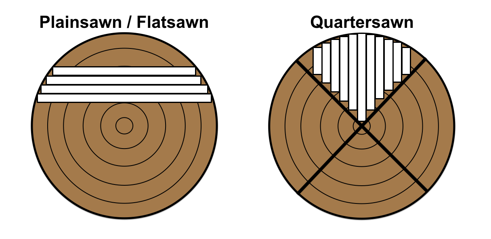

The problem here is that a great deal of variability in the appearance of wood grain can appear even within one species.  Plainsawn wood, in particular, commonly has a pattern called Cathedral Grain where the grain appears in long arches that vaguely resemble those of a cathedral.  This effect is caused by the fact that the slab cuts across the the grain with a great deal of variation in the grain direction.

<figure>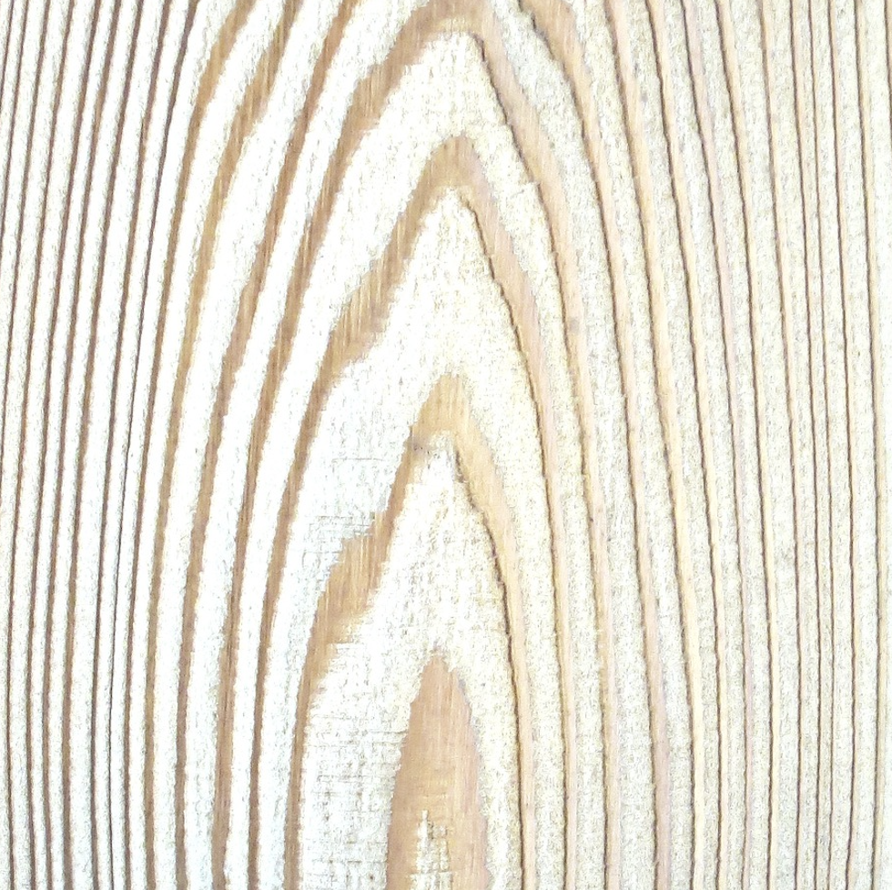<figcaption>The Cathedral Effect</figcaption></figure>  

For this reason I tried to avoid taking pictures of wood with particularly prominent features and stick to samples with straight grain.

## Image Processing

In order to expand the dataset I have to work with, I've built a pre-processing pipeline that works through a number of steps to modify and replicate the images in such a way that they'll provide new value to the model.

1. The images are cropped into square subsets at a certain length/width of pixels, input as a parameter.  In my case, each image I processed yielded 300 subcrops
2. Then these cropped images are rotated 90 degrees, three separate times - this effectively multiplied your cropped image set by 4
3. Finally, the rotated/cropped images are mirrored, adding an additional 2x multiplier to our image set

In the end, you multiply each image in the dataset by 2400 (300 * 4 * 2).

Original image                     |  Cropped image
:-------------------------:|:-------------------------:
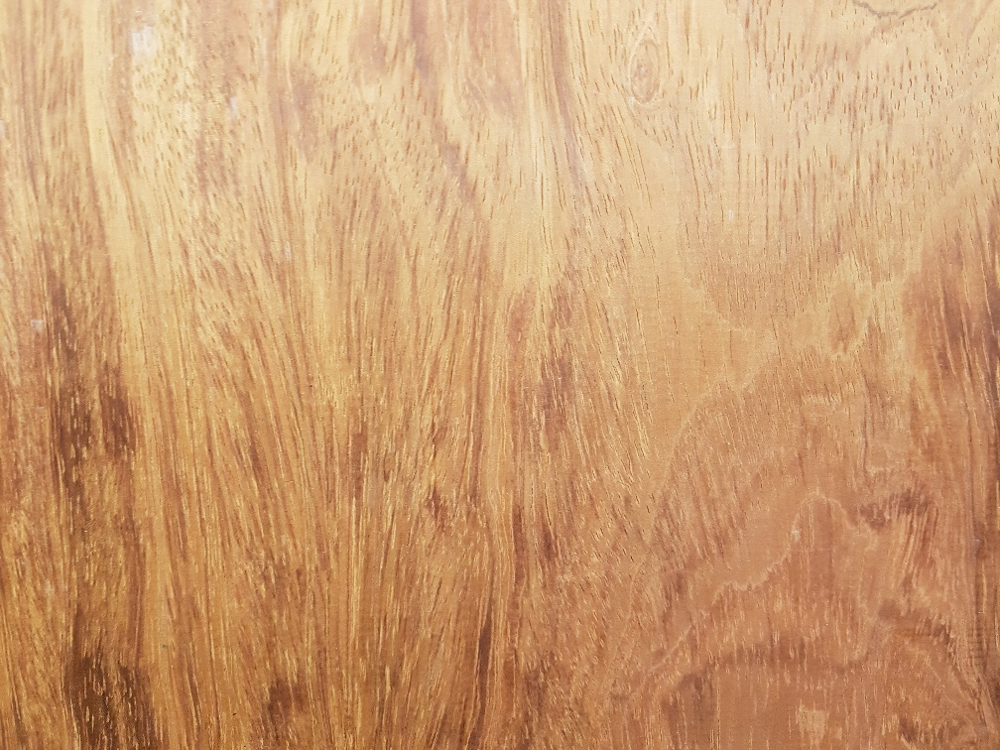  | 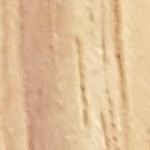

Once cropped, the images are then rotated and mirrored.

  | 
| 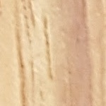  | 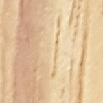

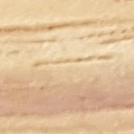  | 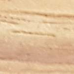
|   | 

## Model Architecture

All of these pre-processed images are fed into a sequential model that runs as follows:

* Three convolutional layers with 'relu' activation functions.
* A max pooling layer
* Neural net has two dense layers with a 'tanh' and finally a 'softmax' activation.
* Compiled with the 'adam' optimizer

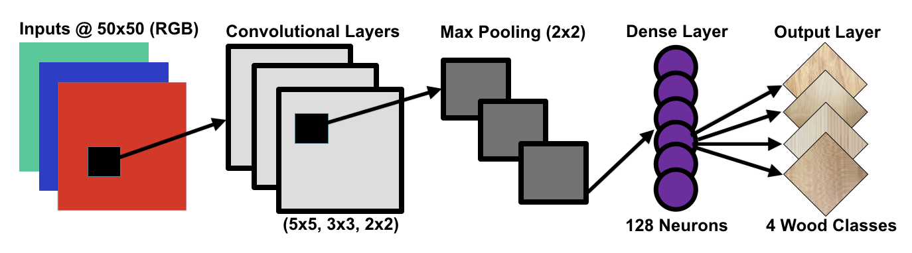

## Training the Model

With the sheer number of images being fed into the model, it quickly becomes difficult to train locally.  I launched an EC2 instance on AWS with a powerful GPU to help cut down the time it took to train so that I could experiment and tune the parameters of the model with greater speed.

## Results

With four classes of wood, I was able to achieve 97.4% test accuracy running the model through ten epochs.  I had 84,480 training samples and 21,120 validation samples.

Pine                     |  Sycamore
:-------------------------:|:-------------------------:
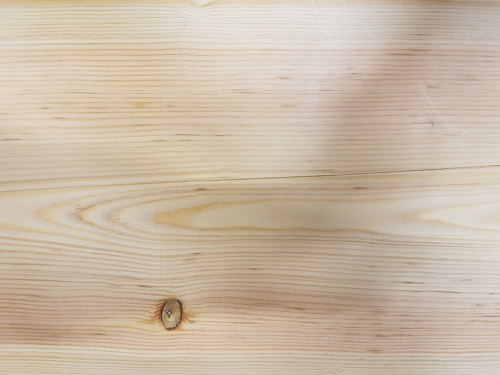 | 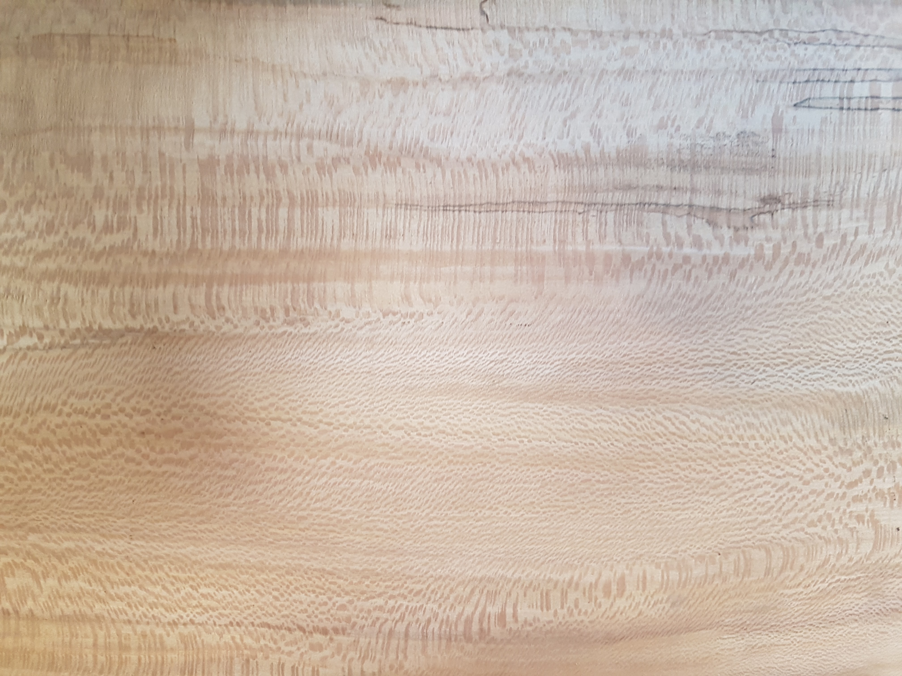
Cherry                     |  Bubinga
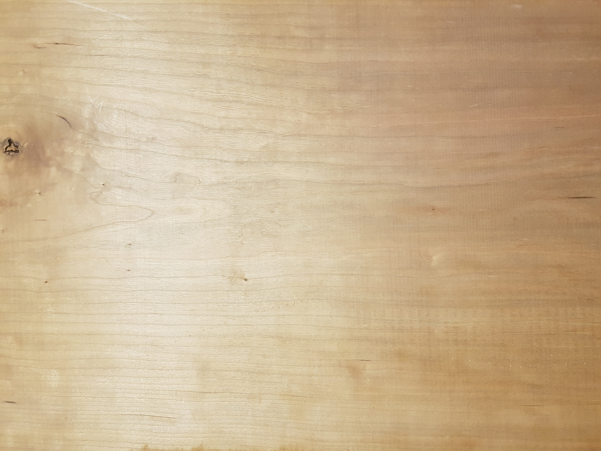 | 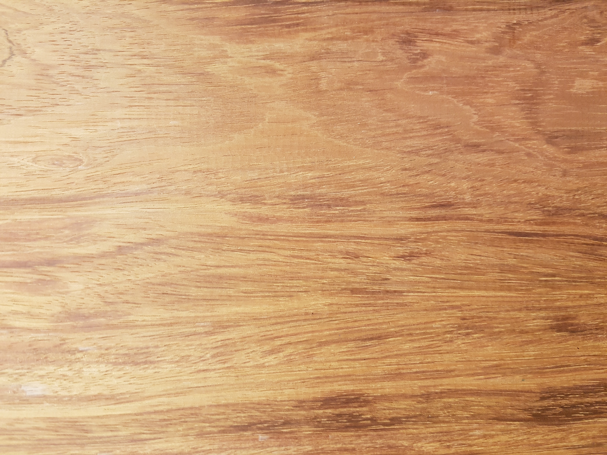

## Future Improvements

With a great deal more data, this model could continue to grow in predictive power.  Ideally I would like to get the class set to the 10 types of wood most commonly used in American carpentry.  The end goal would be a web app where a user can upload an image of wood they're looking at and get an accurate prediction on its species.

By far the hardest part of doing this would be the data collection.  Because of the sheer amount of variety one sees in wood grain of even one type of species, a great deal of imagery would be required to achieve any sort of accuracy, which would then require substantial computing power.

## Technology Stack
      
