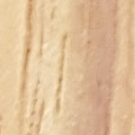

# Woodentify

Woodentify seeks to identify wood species using Convolutional Neural Networks trained on imagery of wood grain

## Table of Contents
1. [Dataset](#dataset)
2. [Image Processing](#image-processing)
3. [Model Architecture](#model-architecture)
4. [Training The Model](#training-the-model)
5. [Results](#results)
6. [Future Improvements](#future-improvements)
7. [Technology Stack](#technology-stack)

## Dataset

The original intent was to scrape images off the web, but initial testing of that method revealed that a great deal of those images are mislabeled, or have other characteristics (like watermarks, or overlaid text descriptors of the photo) which would require manual cleanup.  It turns out that it's much easier to find boards and slabs of wood to take high resolution images of at area wood shops.

The photos themselves are edge grain shots of woods of various types.  I've started with a few classes to make sure that the model can distinguish the grains and am gradually adding classes in as I get the model better-tuned.

## Image Processing

In order to expand the dataset I have to work with, I've built a pre-processing pipeline that works through a number of steps to modify and replicate the images in such a way that they'll provide new value to the model.

1. The images are cropped into square subsets at a certain length/width of pixels, input as a parameter.  For example a 1000 x 1000 image will be split into 100 subset images if you choose a crop size of 100.
2. Then these cropped images are rotated 90 degrees, three separate times - this effectively multiplied your cropped image set by 4
3. Finally, the rotated/cropped images are mirrored, adding an additional 2x multiplier to our image set.

In the end, you multiply each image in the dataset by 8n, with n being the number of images you can subset the original image into based on the size of the crop.

Original image                     |  Cropped image
:-------------------------:|:-------------------------:
  | 

Once cropped, the images are then rotated and mirrored.

  | 
|   | 

  | 
|   | 

## Model Architecture

All of these pre-processed images are fed into a sequential model that runs as follows:

* Three convolutional layers with 'relu' activation functions.
* A max pooling layer
* Data is then flattened to be fed into typical neural net structure
* Neural net has two dense layers with a 'tanh' and finally a 'softmax' activation.
* Compiled with the 'adam' optimizer

## Training the Model

With the sheer number of images being fed into the model, it quickly becomes difficult to train locally.  I launched an EC2 instance on AWS with a powerful GPU to help cut down the time it took to train so that I could experiment and tune the parameters of the model

## Results

With four classes of wood (Pine, Sycamore, Cherry, & Bubinga), I was able to achieve 97.44% accuracy running the model through ten epochs.

## Future Improvements

With a great deal more data, this model could continue to grow in predictive power.  Ideally I would like to get the class set to the 10-15 types of wood most commonly used in American carpentry.  The end goal would be a web app where a user can upload an image of wood they're looking at and get an accurate prediction on its species.

## Technology Stack
